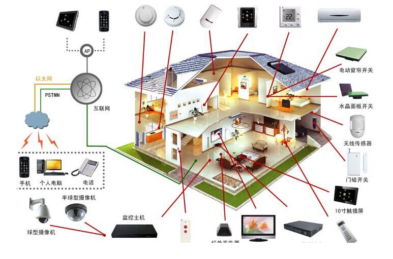

# SmartHome

* スマートホームは、インターネットの影響で、物事化である。スマートホームは物事のインターネットで家庭の様々なデバイス（例えば、オーディオとビデオ機器、照明システム、カーテン制御、空調制御、セキュリティシステム、デジタル・シアター・システム、ビデオ・サーバ、ビデオ・キャビネットシステム、ネットワーク機器など）をネットワーク技術により、スマートホーム一緒に接続され、家電制御、照明制御、電話、リモコン、屋内と屋外のリモートコントロール、盗難警報、環境モニタリング、HVACコントロール、赤外線リピーターとプログラマブル・タイマ手段と制御などの機能をを提供するために一緒に接続されています。普通の家と比較して、スマートホームはただの伝統的な住宅はなくて、建物、ネットワーク通信、情報機器、設備の自動化の両方を備え、総合的な情報交換機能を提供し、さらにはエネルギーコストとお金の節約ができる。
### 概要：
スマートホームとは、1980年代にアメリカで提唱された住宅の概念で、家電や設備機器を情報化配線等で接続し最適制御を行うことで、生活者のニーズに応じた様々なサービスを提供しようとするものである。本研究は、クラウド、IoT、スマートフォンアプリを活用しで、スマートホームシステムを試作し、家の家電制御、照明制御、電話、リモコン、屋内と屋外のリモートコントロール、盗難警報、環境モニタリング、HVACコントロール、赤外線リピーターとプログラマブル・タイマ制御などの機能をを提供する。
 
### 計画：
まず、スマートホームのポスターを作る
そして、スマートホームの中で使う各種デバイスを設定し、デバイスの機能を把握して、理論的に各デバイスの組立を試す。
次に、各種デバイスをまとめて繋がる方法を発見していく
その後、各種デバイスをコントロールできるアプリを開発する。
最後に、アプリと各デバイス通信の時発見した問題を解決し、この設計よりもっと良いスキームがあるかどうかを探す。

